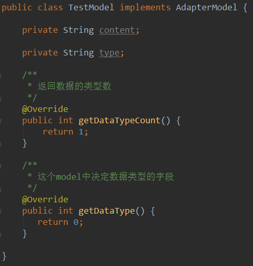
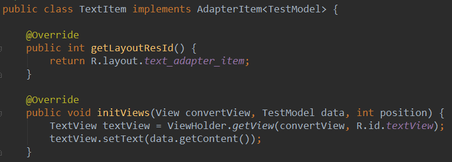
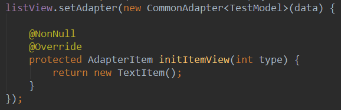

# CommonAdapter

通过封装BaseAdapter和RecyclerView.Adapter得到的通用的，简易的Adapter对象。

--
## ListView+GridView的通用适配器——CommonAdapter  
### Demo:  
Model类：  
  
Adapter中的Item：    
  
给ListView/GridView设置简单的适配器：     
   

### 使用步骤  
### 1. 让你的List中的model实现`AdapterModel`这个接口  
接口的源码如下：  
```java 
public interface AdapterModel {

    /**
     * 得到数据的类型数
     * @return 有多少种数据的类型（item的类型）
     */
    public int getDataTypeCount();

    /**
     * 返回每种数据类型的标识.<br>
     * 需要注意的是：这个的范围只能是[0 , typeCount - 1]
     * @return 每种数据类型的标识
     */
    public int getDataType();
}  
```  
例子：  
```java
public class TestModel implements AdapterModel {

    /**
     * 定义类型标识的时候，必须是从0到type数-1，否则会数组越界.
     * 这里我们是三种类型，所以类型的标识就是0~2
     */
    public static final int TYPE_TEXT = 0;
    public static final int TYPE_BUTTON = 1;
    public static final int TYPE_IMAGE = 2;
    public static final int TYPE_NORMAL = TYPE_TEXT;

    private String content;

    private String type;

    public String getContent() {
        return content;
    }

    public void setContent(String content) {
        this.content = content;
    }

    public void setType(String type) {
        this.type = type;
    }

    public String getType() {
        return this.type;
    }

    /**
     * 返回数据的类型数
     */
    @Override
    public int getDataTypeCount() {
        return 3;
    }

    /**
     * 这个model中决定数据类型的字段
     */
    @Override
    public int getDataType() {
        switch (type) {
            case "button":
                return TYPE_BUTTON;
            case "image":
                return TYPE_IMAGE;
            case "text":
                return TYPE_TEXT;
            default:
                return TYPE_NORMAL;
        }
    }

}

```  
  
### 2. Adapter中的每个Item需要实现`AdapterItem`这个接口  
接口的源码如下：  
```java  
/**
 * adapter的所有item必须实现此接口.
 * 通过返回layoutResId来自动初始化view，之后在initView中就可以初始化item的内部视图了。<br>
 * @author Jack Tony
 * @date 2015/5/15
 */
public interface AdapterItem<T extends AdapterModel> {

    /**
     * 返回item的布局文件id
     *
     * @return layout的id
     */
    @LayoutRes
    public int getLayoutResId();

    /**
     * 根据数据来初始化item的内部view
     *
     * @param convertView adapter中复用的view
     * @param data        数据list内部的model
     * @param position    当前adapter调用item的位置
     */
    public void initViews(View convertView, T data, int position);

}  
```  
例子：
```java
public class TextItem implements AdapterItem<TestModel> {

    @Override
    public int getLayoutResId() {
        return R.layout.text_adapter_item;
    }

    @Override
    public void initViews(View convertView, TestModel data, int position) {
        TextView textView = ViewHolder.getView(convertView, R.id.textView);
        textView.setText(data.getContent());
    }

}

```  

### 3. 通过继承`CommonAdapter`来实现适配器  
现在所需要做的只剩下继承CommonAdapter实现自己的适配器了，下面是一个简单的例子：  
```java
ListView listView = (ListView) findViewById(R.id.listView);
        listView.setAdapter(new CommonAdapter<TestModel>(data) {

            @NonNull
            @Override
            protected AdapterItem initItemView(int type) {
                AdapterItem item;
                switch (type) {
                    case TestModel.TYPE_TEXT:
                        item = new TextItem();
                        break;
                    case TestModel.TYPE_BUTTON:
                        item = new ButtonItem();
                        break;
                    case TestModel.TYPE_IMAGE:
                        item = new ImageItem();
                        break;
                    default:
                        item = new TextItem();
                }
                return item;
            }
        });
```

## RecyclerView的通用适配器——CommonRcvAdapter 
### Demo:  

### 使用步骤：  
### 1. 让你的List中的model实现`AdapterModel`这个接口（同上）
### 2. Adapter中的每个Item需要继承`RcvAdapterItem`这个类  
该类的源码如下：  
```java
/**
 * RecyclerView的Item都需要继承这个类，继承后就可以通过getView来得到Item中的view了
 * @author Jack Tony
 * @date 2015/5/15
 */
public abstract class RcvAdapterItem<T extends AdapterModel> 
                                                    extends RecyclerView.ViewHolder {

    /**
     * 构造方法
     * @param context context对象
     * @param layoutResId 这个item布局文件的id
     */
    public RcvAdapterItem(Context context, @LayoutRes int layoutResId) {
        super(LayoutInflater.from(context).inflate(layoutResId, null));
    }

    /**
     * 设置Item内部view的方法
     * @param data 数据对象
     * @param position 当前item的position
     */
    public abstract void setViews(T data, int position);

    /**
     * 找到view的方法，等同于findViewById()
     * @param id
     * @param <T>
     * @return
     */
    @SuppressWarnings("unchecked")
    protected <T extends View> T getView(int id) {
        return (T) itemView.findViewById(id);
    }

}   
 ```  
例子：  
```java
public class RcvButtonItem extends RcvAdapterItem<TestModel>{

    public RcvButtonItem(Context context, int layoutResId) {
        super(context, layoutResId);
    }

    @Override
    public void setViews(TestModel data, int position) {
        Button btn = getView(R.id.button);
        btn.setText(data.getContent());
    }
}  
```  

### 3. 通过继承`CommonRcvAdapter`来实现适配器  

```java
        recyclerView.setAdapter(new CommonRcvAdapter<TestModel>(data) {
            @NonNull
            @Override
            protected RcvAdapterItem initItemView(Context context, int type) {
                RcvAdapterItem item;
                switch (type) {
                    case TestModel.TYPE_TEXT:
                        item = new RcvTextItem(context, R.layout.text_adapter_item);
                        break;
                    case TestModel.TYPE_BUTTON:
                        item = new RcvButtonItem(context, R.layout.button_adapter_item);
                        break;
                    case TestModel.TYPE_IMAGE:
                        item = new RcvImageItem(context, R.layout.image_adapter_item);
                        break;
                    default:
                        item = new RcvTextItem(context, R.layout.text_adapter_item);
                }
                return item;
            }
        });
```
  
## 设计思路  
其实现在的效果和原本的adapter差不多，只是做了点小的重构，这种重构最终保持了和原本一样的可扩展性。下面我来分析下具体的细节：  

1. **Model**  
现在我强制你的model实现了`AdapterModel`这个接口，你可能会说这样会改变model的纯粹性，添加了两个get的方法，让model和业务又了关系。但是，你原本的model不也是用了很多set和get方法么？这些set和get方法在本质上也都是让业务进行调用的，而现在添加的`getDataTypeCount()`和`getDataType()`也和原来一样，就是一个get方法，get的数据也是model中有的，不是因为业务需要而凭空捏造的。我们当然可以把这两个方法放到适配器的初始化中进行设置，但初始化的时候你不还是要看看model有什么类型，然后再进行设置类型总数和类型标识么？而类型这个东西和model中的数据是密切相关的，所以`getDataTypeCount()`和`getDataType()`和model是最有关系的，而且这种用接口的做法没有改变model的其他熟悉，最关键的是可以大大节约adapter的代码量。

2. **Adapter**  
因为adapter原始的代码很多，所以如果你把adapter作为activity的内部类的话很别扭，而且如果adapter中如果有多个类型的Item，你就必须在getView()中写很多if-else语句，而且里面都是一些设置view的方法，很乱，你要更换Item的话还需要去删减代码，而现在我让adapter的代码量减少到一个方法，如果你需要更新item或者添加一个新的item你直接在initItem中返回即可，实现了可插拔化。最关键的是item现在作为一个独立的对象，内部view的设置完全可以和adapter独立出来。  

3. **AdapterItem**
和原来方式最为不同的就是我把adapter的item作为了一个实体，这种方式借鉴了RecyclerView的ViewHolder的设计。把Item作为实体的好处有很多，就不细说了，最关键的是用这种方式我可以让RecyclerView的建立viewHolder和绑定ViewHolder的工作合二为一，还是减少了重复代码。

4. **One more thing**  
如果你是一个倾向于MVP的开发者，你完全可以把原本项目中独立的adapter变成activity的内部类，这样做增加了adapter和activity的聚合性，同时减少了项目中的众多adapter类。这样的坏处是什么呢？activity现在和adapter的聚合度高了，而现在adapter中仅仅有view，这样activity和view的聚合度也会很高。如果你认为activity是一个controler，那么请千万不要用我的做法，因为这样会让你的项目层次出现混乱。但如果你认为activity就是一个view管理对象，逻辑是写在presenter中的，那么你可以放心的用这种方式。欢迎大家来继续讨论。


## 开发者
  

Jack Tony: <developer_kale@.com>  


## License

    Copyright 2015 Jack Tony

    Licensed under the Apache License, Version 2.0 (the "License");
    you may not use this file except in compliance with the License.
    You may obtain a copy of the License at

       http://www.apache.org/licenses/LICENSE-2.0

    Unless required by applicable law or agreed to in writing, software
    distributed under the License is distributed on an "AS IS" BASIS,
    WITHOUT WARRANTIES OR CONDITIONS OF ANY KIND, either express or implied.
    See the License for the specific language governing permissions and
    limitations under the License.

 
