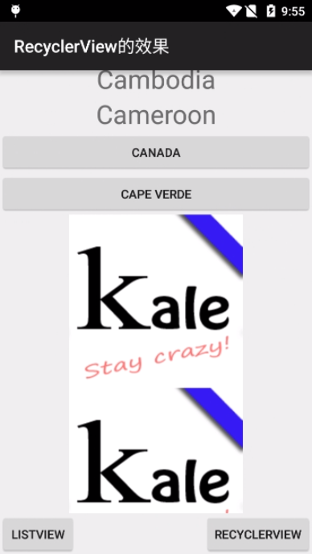

# CommonAdapter

[](http://android-arsenal.com/details/1/1861)  

通过封装BaseAdapter和RecyclerView.Adapter得到的通用、简易的Adapter对象。  

### 添加依赖

1.在项目外层的build.gradle中添加JitPack仓库

```
repositories {
	maven {
		url "https://jitpack.io"
	}
}
```

2.在用到的项目中添加依赖  

```
dependencies {
	compile 'com.github.tianzhijiexian:CommonAdapter:1.1.6'
}    
```

### 已解决的问题

- [x] 提升item的独立性，完美支持item被多处复用
- [x] item会根据type来做自动复用
- [x] 支持多种类型的item
- [x] 仅仅会在item创建完毕后调用一次配置item的操作，不会避免重复建立监听器
- [x] 一个item仅会触发一次绑定视图的操作
- [x] ​支持dataBinding和其他第三方注入框架
- [x] 提供了getView()方法来代替findViewById
- [x] 支持通过item的构造方法来传入Activity对象
- [x] 支持通过item的构造方法来传入item中事件的回调
- [x] 提供了getConvertedData(data, type)方法来对item传入的数据做转换，方便拆包和提升item的复用性
- [x] 支持viewpager的正常加载模式和懒加载
- [x] 支持快速将listview的适配器切换为recyclerView的适配器
- [x] viewpager的notifyDataSetChanged可以正常更新所有数据了
- [x] 支持recyclerView的添加头部和底部
- [x] 支持适配器的数据自动绑定

### 示例



----

### 零、重要接口

adapter的item必须实现此接口，接口源码如下：   

```java
public interface AdapterItem<T> {

    /**
     * @return item布局文件的layoutId
     */
    @LayoutRes
    int getLayoutResId();

    /**
     * 初始化views
     */
    void bindViews(final View root);

    /**
     * 设置view的参数
     */
    void setViews();

    /**
     * 根据数据来设置item的内部views
     *
     * @param model    数据list内部的model
     * @param position 当前adapter调用item的位置
     */
    void handleData(T model, int position);

}  
```

例子：  

```java
public class TextItem implements AdapterItem<DemoModel> {

    @Override
    public int getLayoutResId() {
        return R.layout.demo_item_text;
    }

    TextView textView;

    @Override
    public void bindViews(View root) {
        textView = (TextView) root.findViewById(R.id.textView);
    }

    @Override
    public void setViews() { }

    @Override
    public void handleData(DemoModel model, int position) {
        textView.setText(model.content);
    }
}
```

### 一、ListView+GridView的通用适配器——CommonAdapter

只需继承`CommonAdapter`便可实现适配器：  
```java
listView.setAdapter(new CommonAdapter<DemoModel>(data) {
    public AdapterItem<DemoModel> createItem(Object type) {
        return new TextItem();
    }
});
```

### 二、RecyclerView的通用适配器——CommonRcvAdapter
通过继承`CommonRcvAdapter`来实现适配器：   

```java  	
mAdapter = new CommonRcvAdapter<DemoModel>(data) {
 public AdapterItem createItem(Object type) {
        return new TextItem();
  }
};    
```

### 三、ViewPager的通用适配器——CommonPagerAdapter   
通过继承`CommonPagerAdapter`来实现适配器：   

```java
viewPager.setAdapter(new CommonPagerAdapter<DemoModel>() {
	public AdapterItem createItem(Object type) {
	    return new TextItem();
	}
});
```  

### 设计思路

**1. Adapter**  

因为adapter原始的代码很多，所以如果你把adapter作为activity的内部类的话很别扭，而且如果adapter中如果有多个类型的Item，你就必须在getView()中写很多if-else语句，而且里面都是一些设置view的方法，很乱。你要更换Item的话还需要去删减代码，而现在我让adapter的代码量减少到一个方法，如果你需要更新item或者添加一个新的item你直接在initItem中返回即可，实现了可插拔化。最关键的是item现在作为一个独立的对象，item内部的设置完全可以和adapter独立出来。  

**2. AdapterItem**  

和原来方式最为不同的就是我把adapter的item作为了一个实体，这种方式借鉴了RecyclerView的ViewHolder的设计。把Item作为实体的好处有很多，比如复用啊，封装啊，其余的就不细说了。  

**3. 分层**  

在使用过程中，我发现如果adapter放在view层，那就会影响view层的独立性。因为adapter中有很多数据处理，比如通过type选择item，数据的拆包、转换等操作。于是我还是推荐把adapter放在mvp的p层，或者是mvvm的vm层。通过在实际的项目中使用来看，放在vm或p层的效果较好，view的复用也比较好做。


## 开发者


Jack Tony: <developer_kale@foxmail.com>  


## License

```  

Copyright 2015 Jack Tony

Licensed under the Apache License, Version 2.0 (the "License");
you may not use this file except in compliance with the License.
You may obtain a copy of the License at

   http://www.apache.org/licenses/LICENSE-2.0

Unless required by applicable law or agreed to in writing, software
distributed under the License is distributed on an "AS IS" BASIS,
WITHOUT WARRANTIES OR CONDITIONS OF ANY KIND, either express or implied.
See the License for the specific language governing permissions and
limitations under the License.
```
