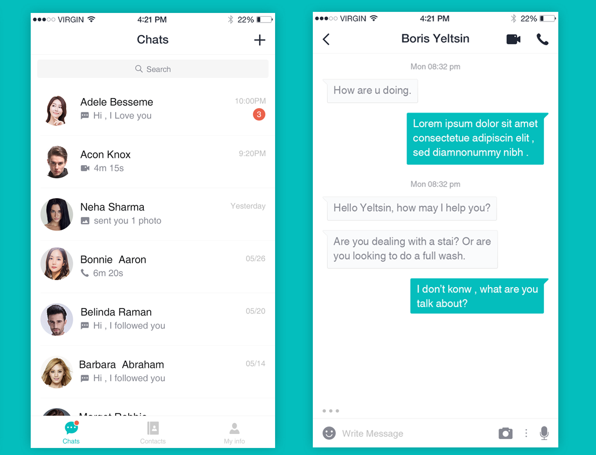

# CommonAdapter
[](http://android-arsenal.com/details/1/1861)
[](https://jitpack.io/#tianzhijiexian/CommonAdapter)

通过封装BaseAdapter和RecyclerView.Adapter得到的通用、简易的Adapter对象。  

### 功能

- [x] 支持多种类型的item
- [x] item会根据type来做自动复用
- [x] ​支持dataBinding和其他注入框架
- [x] 支持ViewPager的懒加载模式
- [x] 提升item的独立性，完美支持item被多处复用
- [x] 一个item仅会触发一次绑定视图的操作，提升效率
- [x] 一个item仅会调用一次setViews()，避免重复建立listener
- [x] 支持快速将ListView的adapter切换为recyclerView的adapter
- [x] 允许用viewpager的notifyDataSetChanged()来更新界面
- [x] 可以给recyclerView的添加空状态（利用`RcvAdapterWrapper`）
- [x] 可以给recyclerView的添加头、底（利用`RcvAdapterWrapper`）
- [x] 提供了getCurrentPosition()来支持根据不同的位置选择不同item的功能
- [x] 提供了getConvertedData(data, type)方法来对item传入的数据做转换，拆包
- [x] 支持在item中获得Activity对象，用来跳转
- [x] 支持RecycleView层面得到item被点击的事件，内外事件会同时触发
- [x] 允许Adapter的数据范形和item中的不同，增加灵活性
- [x] 支持适配器的数据自动绑定，即：数据更改后adapter会自动notify界面（需配合databinding中的`ObservableList`）

### 示例



**上图是在作者的授权下引用了设计师“流浪汉国宝（QQ:515288905）”在UI中国上的[作品](http://www.ui.cn/detail/149952.html)**

我觉得这个设计很简洁清爽，未来可能会出这个设计的android实现。

### 添加依赖

1.在项目外层的build.gradle中添加JitPack仓库

```
repositories {
	maven {
		url "https://jitpack.io"
	}
}
```

2.在用到的项目中添加依赖  
>	compile 'com.github.tianzhijiexian:CommonAdapter:[Latest release](https://github.com/tianzhijiexian/CommonAdapter/releases)(<-click it)'  

**举例：**
```
compile 'com.github.tianzhijiexian:CommonAdapter:1.0.0'
```

### 零、建立Item

Adapter的item须实现AdapterItem接口也可继承AbsAdapterItem，例子：

```java
public class TextItem implements AdapterItem<DemoModel> {

    @Override
    public int getLayoutResId() {
        return R.layout.demo_item_text;
    }

    TextView textView;

    @Override
    public void bindViews(View root) {
        textView = (TextView) root.findViewById(R.id.textView);
    }

    @Override
    public void handleData(DemoModel model, int position) {
        textView.setText(model.content);
    }
}
```

### 一、ListView+GridView的通用适配器——CommonAdapter

只需继承`CommonAdapter`便可实现适配器：  

```java
listView.setAdapter(new CommonAdapter<DemoModel>(list, 1) {
    public AdapterItem<DemoModel> createItem(Object type) {
        return new TextItem();
    }
});
```

### 二、RecyclerView的通用适配器——CommonRcvAdapter

通过继承`CommonRcvAdapter`来实现适配器：   

```java  	
mAdapter = new CommonRcvAdapter<DemoModel>(list) {
 public AdapterItem createItem(Object type) {
        return new TextItem();
  }
};    
```

### 三、ViewPager的通用适配器——CommonPagerAdapter   

通过继承`CommonPagerAdapter`来实现适配器：

```java
viewPager.setAdapter(new CommonPagerAdapter<DemoModel>(list) {
	public AdapterItem createItem(Object type) {
	    return new TextItem();
	}
});
```  

### 四、如果需要RecyclerView的pool

需要通过库提供的[RecycledViewPool](https://github.com/tianzhijiexian/CommonAdapter/blob/master/lib/src/main/java/kale/adapter/RecycledViewPool.java)
来设置pool。

```java
RecycledViewPool pool = new RecycledViewPool();

// ...

recyclerView.setRecycledViewPool(pool);
adapter.setTypePool(pool.getTypePool());
```

### 设计思路 

在使用过程中，我发现如果adapter放在view层，那就会影响到view层的独立性，adapter中经常有很多数据处理的操作，不是单纯的展示。我推荐把adapter放在mvp的p层，或者是mvvm的m层，view的复用也比较好做。


## 开发者


Jack Tony: <developer-kale@foxmail.com>  


## License

```  
Copyright 2016-2019 Jack Tony

Licensed under the Apache License, Version 2.0 (the "License");
you may not use this file except in compliance with the License.
You may obtain a copy of the License at

   http://www.apache.org/licenses/LICENSE-2.0

Unless required by applicable law or agreed to in writing, software
distributed under the License is distributed on an "AS IS" BASIS,
WITHOUT WARRANTIES OR CONDITIONS OF ANY KIND, either express or implied.
See the License for the specific language governing permissions and
limitations under the License.
```
